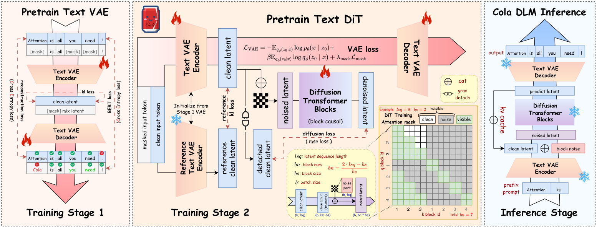
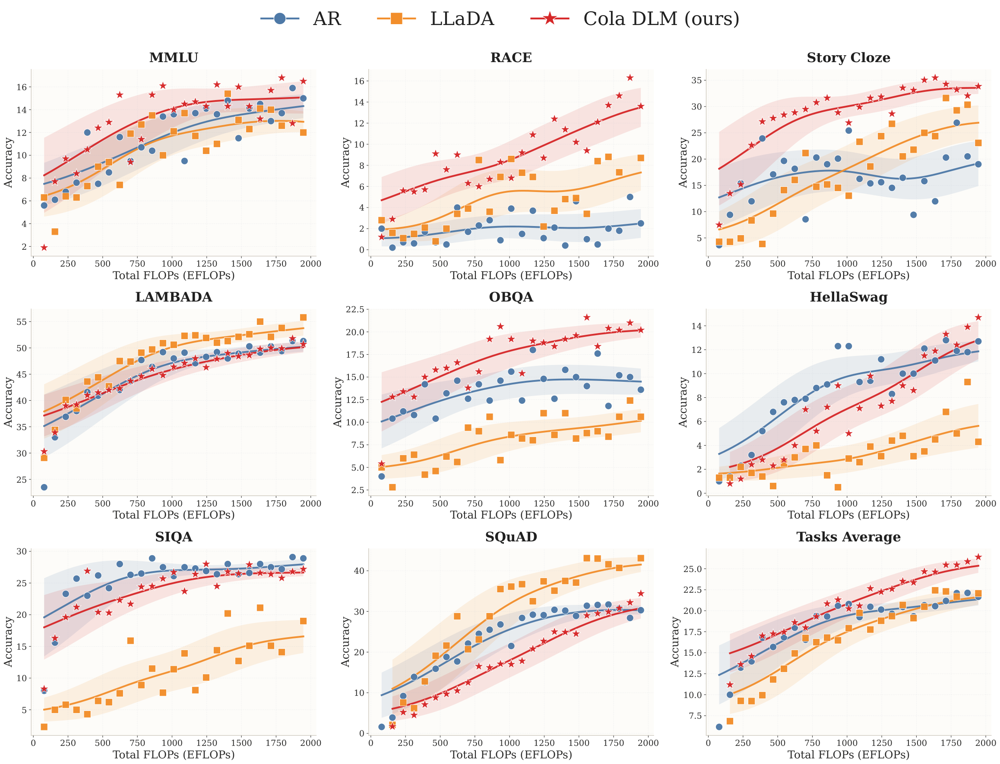
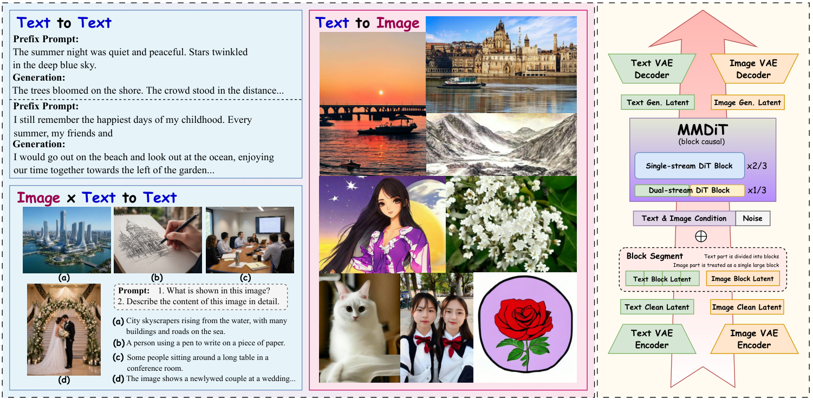

<div align="center">

# Cola DLM

**连续隐空间扩散语言模型 — 在 Text VAE 之上以分块因果 DiT 拟合连续隐先验的层次化语言模型。**

[](https://arxiv.org/abs/2605.06548)
[](https://huggingface.co/ByteDance-Seed/Cola-DLM)
[](https://huggingface.co/papers/2605.06548)
[](https://hongcanguo.github.io/Cola-DLM/)
[](https://hongcanguo.github.io/posts/2026-cola-dlm.html)
[](https://zhuanlan.zhihu.com/p/2038324180920313704)
[](LICENSE)
[](https://www.python.org/)
[](https://pytorch.org/)
[](https://github.com/huggingface/transformers)

[English](README.md) · [中文](README_zh.md)

</div>

> **Cola DLM**（`Co`ntinuous `La`tent `D`iffusion `L`anguage `M`odel，连续隐空间扩散语言模型）是论文 [*Continuous Latent Diffusion Language Model*](https://arxiv.org/abs/2605.06548) 的官方开源实现，原生兼容 HuggingFace Transformers。Cola DLM 是一个**层次化隐变量语言模型**：*Text VAE* 学习离散文本与连续隐序列之间的稳定映射 `q_phi(z_0 | x)`；*分块因果扩散 Transformer（DiT）*以 Flow Matching 在连续隐空间上拟合先验 `p_psi(z_0)`；*条件解码器* `p_theta(x | z_0)` 负责将隐变量还原为离散 token。在统一 Markov 路径视角下，扩散过程做的是**隐空间先验传输（latent prior transport）**而非 token 级观测恢复，从而将"全局语义组织"与"局部文本实现"显式解耦。仓库中提供训练好的 checkpoint 与无填充（NA / flatten-concat）推理流水线，所有变长样本共享单一序列轴，全程不做任何 `max_len` padding。

---

## 论文信息

- **论文标题**：Continuous Latent Diffusion Language Model
- **作者**：Hongcan Guo, Qinyu Zhao, Yian Zhao, Shen Nie, Rui Zhu, Qiushan Guo, Feng Wang, Tao Yang, Hengshuang Zhao, Guoqiang Wei, Yan Zeng（ByteDance Seed 等）
- **arXiv**：[arxiv.org/abs/2605.06548](https://arxiv.org/abs/2605.06548)
- **模型权重**：[huggingface.co/ByteDance-Seed/Cola-DLM](https://huggingface.co/ByteDance-Seed/Cola-DLM)
- **HuggingFace Daily Paper**：[huggingface.co/papers/2605.06548](https://huggingface.co/papers/2605.06548)
- **项目主页**：[hongcanguo.github.io/Cola-DLM](https://hongcanguo.github.io/Cola-DLM/)
- **博客解读**：[hongcanguo.github.io/posts/2026-cola-dlm.html](https://hongcanguo.github.io/posts/2026-cola-dlm.html)
- **知乎文章**：[zhuanlan.zhihu.com/p/2038324180920313704](https://zhuanlan.zhihu.com/p/2038324180920313704)

---

## 方法概览

<p align="center">
  
</p>

<p align="center"><em><strong>图 1 — Cola DLM 总体流程。</strong><strong>训练 Stage 1</strong>：Text VAE 预训练，损失为重构 + BERT 风格 mask + 对基础先验 <code>p_base</code> 的 KL；<strong>训练 Stage 2</strong>：Text VAE 与分块因果 Text DiT 联合训练，DiT 在可见集 <code>V_b</code> 下用 Flow Matching 学习隐先验 <code>p_psi(z_0)</code>；<strong>推理</strong>：前缀编码 <code>q_phi(z<sup>pre</sup> | x<sup>pre</sup>)</code>、隐空间内分块先验传输 <code>Phi<sup>psi</sup><sub>0←1</sub></code>、以及带 KV cache 的条件解码 <code>p_theta(x | z_0)</code>。</em></p>

Cola DLM 将文本生成定义为以下层次化联合分布：

```
p(x, z_0) = p_theta(x | z_0) * p_psi(z_0),    p(x) = ∫ p_theta(x | z_0) * p_psi(z_0) dz_0,
```

其中 `q_phi(z_0 | x)` 仅作为变分推断 / 前缀编码用的 inference model（不是生成模型本身）。隐变量在序列维上分解为 `B` 个 block：`z_0 = (z_0^(1), ..., z_0^(B))`，先验自然写成块因果分解 `p_psi(z_0) = p_psi(z_0^(1)) * ∏_{b≥2} p_psi(z_0^(b) | z_0^(<b))`，与 DiT 的分块因果注意力一一对应。

训练分两个阶段：

1. **Stage 1：Text VAE 预训练。** 学习稳定的"文本↔隐空间"对应关系（`q_phi`、`p_theta`），损失为重构 + BERT 风格 mask + 对基础先验 `p_base` 的 KL 正则。
2. **Stage 2：Text VAE + 分块因果 Text DiT 联合预训练。** DiT 在可见集 `V_b = {sg(z_0^(<b)), z_t^(b)}` 下用条件 **Flow Matching** 学习隐先验 `p_psi(z_0)`；与此同时 VAE 仍然可训，但加上重构、mask 与一个 reference-encoder KL 正则项以抑制隐空间漂移。

推理（即本仓库的代码）严格对应论文的三步推理流程：**(i) 前缀编码** `z^pre ~ q_phi(z^pre | x^pre)`；**(ii) 分块生成** —— 在历史条件下用先验流传输噪声种子，`hat z_0^(b) = Phi^psi_{0←1}(eps^(b); z^pre, hat z_0^(<b))`，其中 `eps^(b) ~ N(0, I)`；**(iii) 条件解码** `hat x^res ~ p_theta(x^res | z^pre, hat z_0^(1:B))`。论文符号到代码路径的完整对应关系见 [`docs/architecture_zh.md`](docs/architecture_zh.md)。

---

## 目录

- [核心特性](#核心特性)
- [安装](#安装)
- [快速开始](#快速开始)
- [OpenAI 兼容部署](#openai-兼容部署)
- [评测基准](#评测基准)
- [统一文本–图像（前期探索）](#统一文本图像前期探索)
- [代码结构](#代码结构)
- [详细文档](#详细文档)
- [引用](#引用)
- [许可证](#许可证)

---

## 核心特性

- **层次化隐变量建模**：`ColaTextVAEModel` 提供编码器 `q_phi` 与条件解码器 `p_theta`；`ColaDiTModel` 参数化分块因果隐先验 `p_psi`。扩散用于"传输隐先验"（论文式 2.1.4），不是用来"恢复 token"。
- **原生 HuggingFace 兼容**：`ColaDiTModel` / `ColaTextVAEModel` 继承自 `transformers.PreTrainedModel`，配套 `PretrainedConfig`，`from_pretrained` / `save_pretrained` / `AutoConfig` 开箱可用。
- **无填充 NA 推理**：变长样本沿单一序列轴拼接，伴随 `txt_shape: (B, 1)` 表示每个样本的长度；RoPE、注意力掩码与先验传输循环完全由该长度张量驱动，整个推理过程不分配 `max_len` padding。
- **分块因果先验 + CFG**：DiT 在每一步生成中实现一个 block 的 `Phi^psi_{0←1}`，并按训练时的 visible set `V_b` 约束注意力。每步同时执行条件（带 prompt KV cache）与无条件（空前缀）两次前向，并按训练时的 CFG 公式融合。
- **完整 KV Cache**：DiT 与 VAE decoder 均支持跨 block 的 K/V 缓存，仅对新生成块的 Q 走全量注意力，显著降低重复代价。
- **OpenAI 兼容服务部署**：[`openai_adapter/`](openai_adapter/) 通过 `POST /v1/chat/completions` 暴露 Cola DLM，便于接入现有 OpenAI 风格客户端、网关和评测工具。
- **可复现评测**：[`scripts/run_benchmark.sh`](scripts/run_benchmark.sh) 一键复现论文 RQ4 中的 8 项任务（LAMBADA、MMLU、OBQA、HellaSwag、RACE、SIQA、SQuAD、Story Cloze），支持多卡数据并行。

更详细的技术描述请见 [`docs/architecture_zh.md`](docs/architecture_zh.md) 与 [`docs/model_card_zh.md`](docs/model_card_zh.md)。

---

## 安装

Cola DLM 面向 **Python 3.9+** 与 **PyTorch 2.1+**，支持 Linux / macOS。

### 从源码安装（推荐）

```bash
git clone https://github.com/your-org/cola-dlm.git
cd cola-dlm

# 可编辑安装（只含运行依赖）
pip install -e .

# 或者加上开发依赖（pytest / ruff / black / pre-commit）
pip install -e ".[dev]"
```

### 从 PyPI 安装（发布后）

```bash
pip install cola-dlm
```

---

## 快速开始

### 1. 准备模型权重

从 [ByteDance-Seed/Cola-DLM](https://huggingface.co/ByteDance-Seed/Cola-DLM) 下载 HuggingFace 格式的模型权重，或将兼容的本地权重放到 `hf_models/cola_dlm/` 下：

```
hf_models/
├── cola_dlm/
│   ├── cola_dit/        # config.json + model.safetensors
│   └── cola_vae/        # config.json + model.safetensors
└── tokenizer.json
```

### 2. Python API 调用

```python
import torch
from tokenizers import Tokenizer
from cola_dlm import (
    ColaDiTModel,
    ColaTextVAEModel,
    generate_task_repaint_inference,
)

device = torch.device("cuda" if torch.cuda.is_available() else "cpu")

dit = ColaDiTModel.from_pretrained("hf_models/cola_dlm/cola_dit").to(device)
vae = ColaTextVAEModel.from_pretrained("hf_models/cola_dlm/cola_vae").to(device)
tokenizer = Tokenizer.from_file("hf_models/tokenizer.json")

prompts = [{"question": "Question: What is the capital of France? Answer:"}]
results = generate_task_repaint_inference(
    dit=dit,
    vae=vae,
    tokenizer=tokenizer,
    prompts=prompts,
    task_name="lambada",
    device=device,
    max_new_tokens=32,
    temperature=0.0,
    guidance_scale=7.0,
    timestep_num=16,
    pad_token_id=100277,
)
print(results[0]["generate"])
```

`generate_task_repaint_inference` 端到端实现论文的推理算法：(i) 通过 Text VAE 编码 prompt 得到前缀隐变量；(ii) 通过分块因果 DiT 在历史条件下做隐空间先验传输；(iii) 通过条件解码器还原 token。可运行的端到端示例请见 [`examples/quickstart.py`](examples/quickstart.py)。

### 3. 命令行推理

```bash
cola-dlm-infer \
    --dit_path hf_models/cola_dlm/cola_dit \
    --vae_path hf_models/cola_dlm/cola_vae \
    --tokenizer_path hf_models/tokenizer.json \
    --input_jsonl generate_task_data/lambada.jsonl \
    --output_dir eval_output/my_run \
    --task_name lambada
```

运行 `cola-dlm-infer --help` 查看完整参数列表。

---

## OpenAI 兼容部署

[`openai_adapter/`](openai_adapter/) 新增了一个轻量 HTTP 服务，可以用 OpenAI 兼容的 Chat Completions API 部署 Cola DLM：

```text
POST /v1/chat/completions
```

在仓库根目录安装 adapter 依赖：

```bash
pip install -e .
pip install -r openai_adapter/requirements.txt
```

然后指定模型路径和可选 Bearer token，启动服务：

```bash
export COLA_DIT_PATH=hf_models/cola_dlm/cola_dit
export COLA_VAE_PATH=hf_models/cola_dlm/cola_vae
export COLA_TOKENIZER_PATH=hf_models/tokenizer.json
export COLA_MODEL_NAME=cola-dlm
export COLA_API_KEY=change-me

uvicorn openai_adapter.server:app --host 0.0.0.0 --port 8000
```

服务支持 `GET /health`、`GET /v1/models` 与非流式 `POST /v1/chat/completions`。请求示例、环境变量和生产部署注意事项见 [`openai_adapter/README_zh.md`](openai_adapter/README_zh.md)。

---

## 评测基准

<p align="center">
  
</p>

<p align="center"><em><strong>图 2 — RQ4 头号 scaling 实验。</strong>在严格匹配的 ~2B 参数规模、统一的<em>生成式</em>评测协议、最高约 2000 EFLOPs 训练计算量下，对比 8 个 benchmark 的 scaling 曲线。<strong>Cola DLM（红色）</strong>取得最高的最终 Task Average，且曲线<em>仍在上升</em>；在偏推理的 <strong>MMLU、RACE、Story Cloze、OBQA</strong> 上优势明显，<strong>SQuAD</strong> 也最终超过 AR 并逼近 LLaDA 的强势区间。需要强调的是这是一个保守的实验设置：隐变量维度 <code>d=16</code>、未做额外的延长训练，仍有继续 scale 的空间。</em></p>

`scripts/` 下提供与论文 RQ4 相同的 8 项任务一键复现流水线：

```bash
# 评测全部 8 个任务（假设 hf_models/ 和 generate_task_data/ 已准备好）
bash scripts/run_benchmark.sh

# 单任务，单卡
TASKS="lambada" NUM_GPUS=1 bash scripts/run_benchmark.sh

# 根据评测输出计算准确率
python scripts/acc_calc.py
```

参考准确率（参见 [`eval_output/accuracy_summary.csv`](eval_output/accuracy_summary.csv)）：

| 任务         | 准确率（%） |
|--------------|-------------|
| LAMBADA      | 50.80       |
| MMLU         | 19.30       |
| OBQA         | 23.00       |
| HellaSwag    | 10.70       |
| RACE         | 19.60       |
| SIQA         | 28.90       |
| SQuAD        | 30.90       |
| Story Cloze  | 30.77       |
| **Tasks Average** | **26.75** |

> **关于开源模型与准确率说明：**
> 当前开源的模型权重对应论文 RQ4 scaling 曲线中训练量最大的 **2000 EFLOPs** checkpoint。由于论文中评测使用的内部模型架构与本仓库基于 HuggingFace Transformers 重构的开源架构存在细微差异，各任务的准确率数值会有小幅波动，但整体趋势与论文报告一致。此外，本仓库测出的 **Tasks Average（26.75%）高于论文中报告的最终平均水平**。

---

## 统一文本–图像（前期探索）

<p align="center">
  
</p>

<p align="center"><em><strong>图 3 — 通向统一文本–图像建模。</strong>不同模态各自的 VAE 编码/解码器接入<em>共享的</em>分块因果 MMDiT 先验，对联合隐空间状态进行建模——同一套层次化隐先验分解可以自然地从文本扩展到图像。<em>左</em>：纯文本续写 + 以图像为条件的文本生成（image-to-text）。<em>中</em>：仅基于自有内部预训练（无 SFT、无高质量数据筛选）的 text-to-image 样例。<em>右</em>：共享分块因果 MMDiT 先验的结构示意图。这是一个有意保持初期阶段的探索——更全面的多模态联合训练留作未来工作。完整的定性样本请参见论文 Discussion 一节。</em></p>

> 当前开源仓库仅覆盖 Cola DLM 的**纯文本**流水线（Text VAE + 分块因果 DiT 先验）。统一文本–图像训练与推理在论文 Discussion 中作为前期实验报告，不包含在本次开源发布中。

---

## 代码结构

```
cola-dlm/
├── cola_dlm/                 # Python 包
│   ├── __init__.py           # 对外 API
│   ├── configuration_cola_dit.py   # ColaDiTConfig — 分块因果 DiT 先验配置
│   ├── configuration_cola_vae.py   # ColaTextVAEConfig — Text VAE 配置
│   ├── modeling_cola_dit.py  # ColaDiTModel — 分块因果 DiT 先验 p_psi(z_0)
│   ├── modeling_cola_vae.py  # ColaTextVAEModel — 编码器 q_phi + 条件解码器 p_theta
│   ├── attention_utils.py    # NA flatten-concat 工具 + 分块因果 mask（visible set V_b）
│   └── inference.py          # 批量评测 CLI + generate_task_repaint_inference
├── docs/                     # 架构 / 模型卡 / 推理文档
├── examples/                 # 可运行的最小示例
├── openai_adapter/            # OpenAI 兼容 HTTP 服务 adapter
├── scripts/                  # Shell 脚本（评测 + 准确率计算）
├── tests/                    # 单测与 smoke 测试
├── eval_output/              # 参考评测输出（CSV 汇总已纳入版本库）
├── generate_task_data/       # 评测 JSONL 数据
├── pyproject.toml            # 打包与依赖配置
├── requirements.txt          # 锁定的运行依赖
├── LICENSE                   # Apache-2.0
├── NOTICE                    # Apache-2.0 第三方归属
├── SECURITY.md               # 安全报告
└── README.md / README_zh.md  # 项目文档
```

---

## 详细文档

更完整的文档位于 [`docs/`](docs/)：

- [`docs/architecture_zh.md`](docs/architecture_zh.md) — 层次化隐变量框架、VAE + DiT 架构、分块先验传输循环、CFG、NA flatten-concat 布局、Stage 1 / Stage 2 训练参考。
- [`docs/model_card_zh.md`](docs/model_card_zh.md) — 预期用途、训练数据、局限、偏见与 Responsible-AI 说明。
- [`docs/inference_zh.md`](docs/inference_zh.md) — 批量评测与 Python API 用法。
- [`openai_adapter/README_zh.md`](openai_adapter/README_zh.md) — OpenAI 兼容 HTTP 服务的部署与调用说明。

安全相关问题请按 [`SECURITY.md`](SECURITY.md) 报告。

---

## Star 历史

<a href="https://www.star-history.com/?repos=ByteDance-Seed%2FCola-DLM&type=date&legend=top-left">
 <picture>
   <source media="(prefers-color-scheme: dark)" srcset="https://api.star-history.com/chart?repos=ByteDance-Seed/Cola-DLM&type=date&theme=dark&legend=top-left" />
   <source media="(prefers-color-scheme: light)" srcset="https://api.star-history.com/chart?repos=ByteDance-Seed/Cola-DLM&type=date&legend=top-left" />
   
 </picture>
</a>

---

## 引用

如果 Cola DLM 对你的研究有帮助，请引用论文：

```bibtex
@article{guo2026cola,
  title   = {Continuous Latent Diffusion Language Model},
  author  = {Guo, Hongcan and Zhao, Qinyu and Zhao, Yian and Nie, Shen and
             Zhu, Rui and Guo, Qiushan and Wang, Feng and Yang, Tao and
             Zhao, Hengshuang and Wei, Guoqiang and Zeng, Yan},
  journal = {arXiv preprint arXiv:2605.06548},
  year    = {2026},
  url     = {https://arxiv.org/abs/2605.06548},
}
```

可同时引用本开源仓库：

```bibtex
@software{cola_dlm_2026,
  title   = {Cola DLM: Official Open-Source Inference Code for Continuous Latent Diffusion Language Model},
  year    = {2026},
  url     = {[https://github.com/your-org/cola-dlm](https://github.com/ByteDance-Seed/Cola-DLM/)},
  version = {0.1.0}
}
```

---

## 许可证

Cola DLM 使用 [Apache License 2.0](LICENSE) 许可证；第三方组件的归属请见 [`NOTICE`](NOTICE)。
